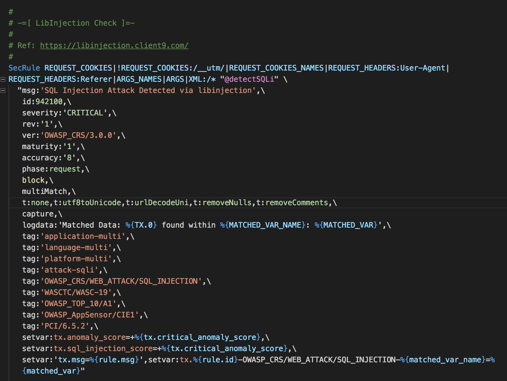

# vscode-language-modsecurity

This extension adds language support for ModSecurity configuration files to [Visual Studio Code](https://code.visualstudio.com/).

The language syntax was based off the one from the Sublime Text package [lifeforms/sublime-modsecurity](https://github.com/lifeforms/sublime-modsecurity).

## License

[BSD-2](LICENSE)
